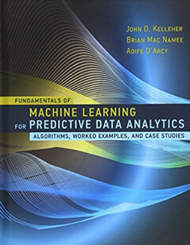
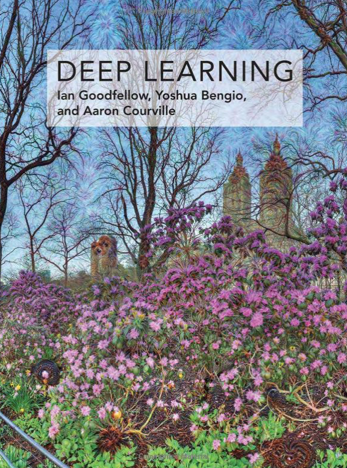

<h2>Estes são os links do primeiro dia do Workshop</h2>
Paulo Rios  

**Minha empresa de consultoria em Genebra, Suíça**  
http://DataCyz.com

**Meu blog**  
http://Cyzne.com

**Minha conta no LinkedIn**  
https://www.linkedin.com/in/paulocriosjr/

**O que deve ter num curso de Data Science**  
http://www.cyzne.com/?p=1061

**Data Science e dinossauros do tempo atual**  
http://www.cyzne.com/?p=1025

**Conjunto de dados reais em domínio público**  
http://archive.ics.uci.edu/ml/datasets.html

**Conjunto de dados do censo**  
http://archive.ics.uci.edu/ml/datasets/Census+Income

**Site de competições de Data Science e Machine Learning**  
Também há muitos conjuntos de dados interessantes 
https://www.kaggle.com

**Bom livro introdutório de Machine Learning**  

Fundamentals of Machine Learning for Predictive Data Analytics: Algorithms, Worked Examples, and Case Studies (MIT Press)  
de John. D. Kelleher e Brian Mac Namee  
https://www.amazon.com/dp/0262029448/

**O melhor livro atual de Deep Learning**  

Deep Learning   
de Ian Goodfellow e Yoshua Bengio  
https://www.amazon.com/Deep-Learning-Adaptive-Computation-Machine/dp/0262035618/

